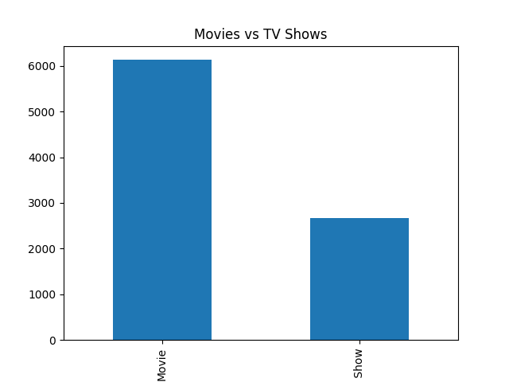
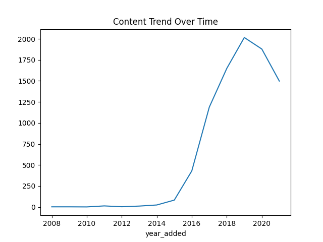
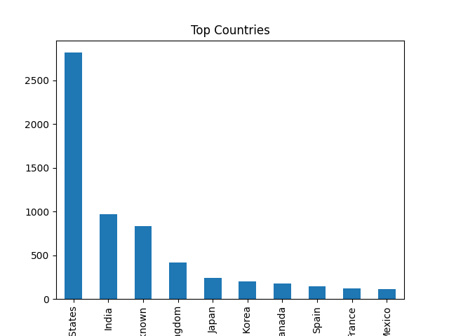

# OTT Data Pipeline & Analysis

ETL and SQL analytics project using Python to clean OTT platform data, model structured tables, and analyze content trends.

---

## Overview

This project focuses on cleaning, transforming, and analyzing OTT platform data to uncover trends in content distribution, genre popularity, and production patterns.

The workflow includes:
- Data cleaning and preprocessing
- Feature engineering
- SQL-based analysis
- Visualization and insight generation

---

## Tech Stack

- Python (Pandas, NumPy, Matplotlib)
- SQL (SQLite via Python)
- Jupyter Notebook

---

## Project Structure
```
ott-platform-data-analysis-etl-pipeline/
│
├── data/
│   └── cleaned_ott_data.csv
│
├── notebooks/
│   └── ott_etl_pipeline.ipynb
│
├── sql/
│   └── analysis_queries.sql
|   |── SQL_queries_in_python.ipynb
│
├── outputs/
│   ├── movies_vs_tv.csv
│   ├── movies_vs_tv.png
│   ├── top_countries.csv
│   ├── top_countries.png
│   ├── content_trend.csv
│   ├── content_trend.png
│
├── images/
│   ├── movies_vs_tv.png
│   ├── top_countries.png
│   ├── content_trend.png
├── README.md
```

---

## Key Analysis Performed

- Distribution of Movies vs TV Shows
- Content production trends over time
- Top contributing countries
- Genre distribution analysis

---

## Key Insights

- Movies dominate the platform compared to TV Shows
- Content production increased significantly after 2015
- A small number of countries contribute most content
- Certain genres consistently dominate the platform

---

## Sample Output






---

## Business Impact
This project helps analysts:
- Understand content distribution across movies and TV shows
- Identify dominant genres and content trends
- Analyze country-level contribution to platform content
- Build a repeatable ETL workflow for cleaned analytics-ready data
- Use SQL-based analysis to support content strategy decisions

---

## Notes

SQL queries used in this project are included in the SQL folder and were executed using SQLite within Python.
